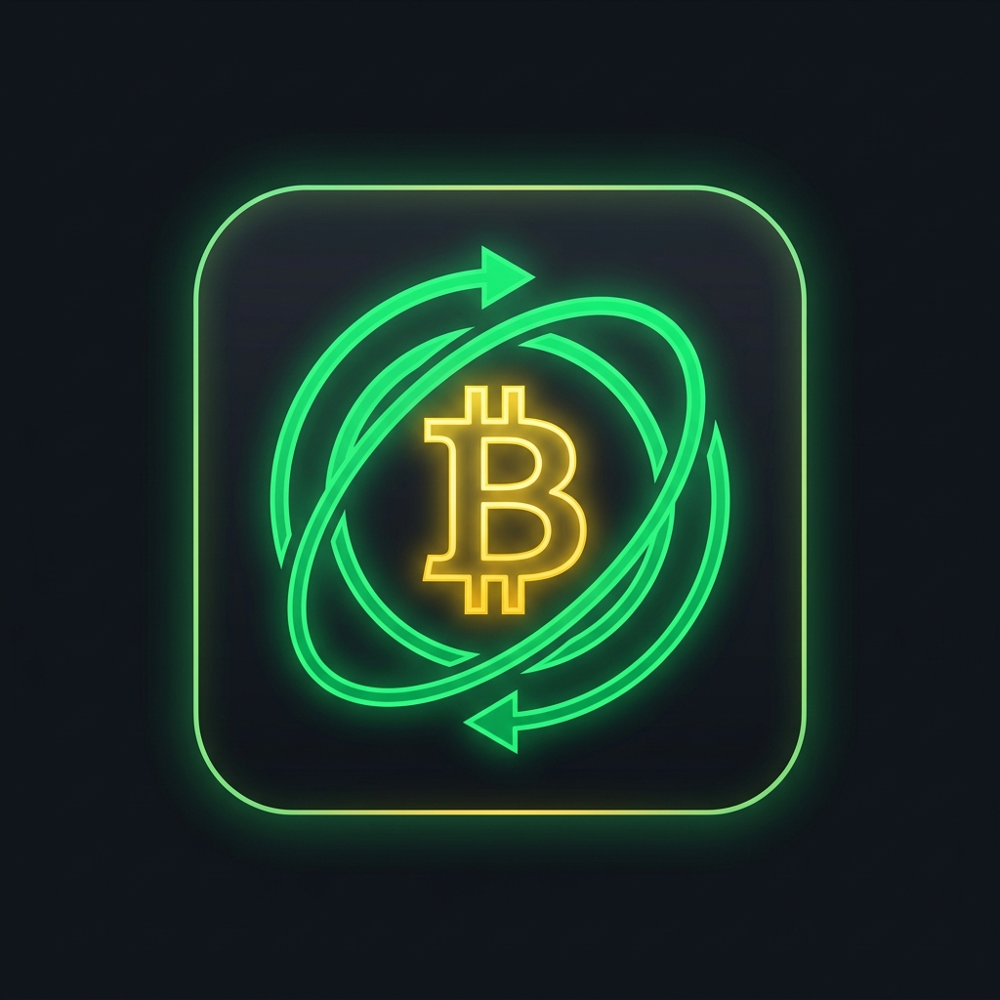

  

  
  
  

---

## What I build

I build autonomous AI systems that take real actions with real consequences — trading capital, navigating DeFi, accelerating other developers. Not chatbots. Not demos. Systems that *ship* and do work in production.

**Available for freelance + consulting.** Best fit: hard problems with tight deadlines where the bar is "ship it," not "explore possibilities."

## Flagship projects

<table>
  <tr>
    <td align="center" width="33%">
      <a href="https://github.com/Chris0x88/hyperliquid-agent">
         
        <b>hyperliquid-agent</b>
      </a> 
      Autonomous Hyperliquid trading agent. 23 strategies orchestrated by APEX. No fees, no telemetry, your hardware. Open source.
    </td>
    <td align="center" width="33%">
      <a href="https://github.com/Chris0x88/spacelord">
         
        <b>Space Lord</b>
      </a> 
      AI-driven Hedera DeFi toolkit on local edge compute. SaucerSwap integration, token analysis, fully local-first.
    </td>
    <td align="center" width="33%">
      <a href="https://github.com/Chris0x88/claude-cli-auth">
         
        <b>claude-cli-auth</b>
      </a> 
      Authentication tooling for Claude Code workflows. Small, sharp, useful — built to kill a friction point I hit daily.
    </td>
  </tr>
  <tr>
    <td align="center" width="33%">
      <a href="https://github.com/Chris0x88/btc-rebalancer">
         
        <b>btc-rebalancer</b>
      </a> 
      Automated BTC/USDC rebalancing robot on Hedera + SaucerSwap. In production.
    </td>
    <td align="center" width="33%">
      <a href="https://github.com/Chris0x88/saucerswap-python-sdk">
         
        <b>saucerswap-python-sdk</b>
      </a> 
      The SDK I wished existed, so I built it. Powers my own trading infra and yours.
    </td>
    <td align="center" width="33%">
      <a href="https://github.com/Chris0x88?tab=repositories">
         
      </a> 
      Freelance + consulting available — <a href="mailto:christopherimg+chris0x88@gmail.com">get in touch</a>.
    </td>
  </tr>
</table>

## How I work

I reach for the **least complex architecture that ships**. Spec first, working software next, polish last. I build in the open, I build for real users, and I build to earn the next iteration — not to impress framework maximalists.

Biases: edge-first, local-first, own-your-data, no unnecessary dependencies, no vendor lock-in I can't walk away from.

## Stack

---

📬 <a href="mailto:christopherimg+chris0x88@gmail.com">christopherimg+chris0x88@gmail.com</a> · 🌐 <a href="https://chris0x88.github.io">portfolio</a> · 🐙 <a href="https://github.com/Chris0x88">github.com/Chris0x88</a> · 🤗 <a href="https://huggingface.co/Chris0x88">huggingface.co/Chris0x88</a>
