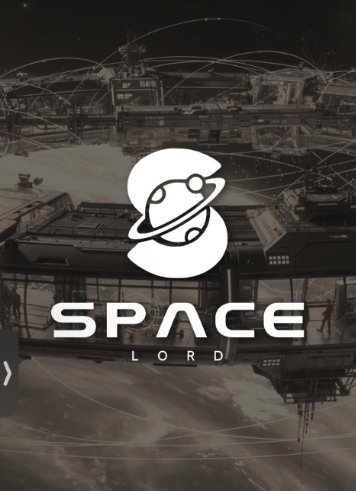

<ssarily="center">
  

  

  
  
  

---

## What I Build

> I build autonomous trading agents, risk systems, and direct-to-chain SDKs—tools designed to give you edge compute without sacrificing sovereignty. No fragile middle-layers, no rented infrastructure. Just keys on your machine and code you control.
>
> **The Core Principle:** Deterministic code for execution, AI for judgment. Slash commands handle the fast, zero-credit operations, while LLMs handle the complex reasoning. You shouldn't trust a system blindly; you should be able to argue with it. 

## Flagship Projects

### [hyperliquid-agent](https://github.com/Chris0x88/hyperliquid-agent) — *An AI trading co-pilot that lives inside your Hyperliquid client*

Not a bot that trades for you—a partner that sits beside you. It reads your positions, drafts stop losses, and actively challenges your thesis if you scale leverage too high. It carries the operational workload (account state, trailing stops) so you can stay focused on the trade. Built on Claude Code's runtime with API keys securely locked on your local machine.

 

### [Space Lord](https://github.com/Chris0x88/spacelord) — *Your Hedera wallet, exchange, and trading desk in one local CLI*

Built for the **2026 Hedera Apex Hackathon**. A raw edge-compute execution surface for AI agents. It provides direct, own-rolled communications to Hedera mainnet, cutting out APIs that can rate-limit or rug you. The agent drives via strict CLI tools, meaning the LLM can't invent swaps or bypass read-only governance caps.

 

### [AusFuelWatch](https://github.com/Chris0x88/AUS_FUEL_WATCH) — *A live map of the ships carrying Australia's fuel*

Built during the March 2026 fuel crisis to monitor the Singapore corridor—the leading indicator for Australian pump prices. It uses three localhost processes (AIS WebSocket proxy, Claude intel server, and a standalone HTML dashboard) with zero backend or login required. Tanker departures are detected via snapshot diff across the open Indian Ocean.

 

### [power-law-allocation](https://github.com/Chris0x88/power-law-allocation) — *A Bitcoin allocation model that decides the BTC/cash split for you*

A ~400-line, zero I/O Lambda function that ships with a venue-agnostic rebalancer. No ML, no databases—just a power law, Kleiber's Law, and a heartbeat. It strictly rebalances at a 15% threshold, banking value on every swing while avoiding fee drag. Five locked constants, zero manual tuning.

 

### [saucerswap-python-sdk](https://github.com/Chris0x88/saucerswap-python-sdk) — *A direct line from an AI agent to SaucerSwap*

A production Python SDK talking directly to SaucerSwap V2 router contracts. Built for AI agents that require deterministic, always-on execution in Hedera DeFi without risking middleware outages. This powers my own trading stack and is open-sourced for anyone building resilient on-chain agents.

 

---

## How I Work

I optimize for small, readable systems that survive the 3am weekend stop-hunt. Keys belong on disk, code on GitHub, and nothing should secretly phone home. I'd rather ship a 400-line model that is completely transparent than rely on a bloated framework I don't fully understand.

## Stack & Stats

  

  
  
  

 

  

---

📬 <a href="mailto:rhczs6bz4d@privaterelay.appleid.com">rhczs6bz4d@privaterelay.appleid.com</a> · 🌐 <a href="https://chris0x88.github.io">portfolio</a> · 🐙 <a href="https://github.com/Chris0x88">github.com/Chris0x88</a> · 🤗 <a href="https://huggingface.co/Chris0x88">huggingface.co/Chris0x88</a>
